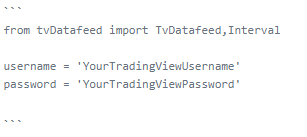

# **NOTE**

This is a fork of the original [TvDatafeed](https://github.com/rongardF/tvdatafeed.git) project by StreamAlpha. This fork has live data retrieving feature implemented. 
More information about this will be found in the TvDatafeedLive section down below in the README.

# **TvDatafeed**

A simple TradingView historical Data Downloader. Tvdatafeed allows downloading upto 5000 bars on any of the supported timeframe.

If you found the content useful and want to support my work, you can buy me a coffee!
[](https://www.buymeacoffee.com/StreamAlpha)

## Installation

This module can be installed from github repo

```sh
pip install --upgrade --no-cache-dir git+https://github.com/rongardF/tvdatafeed.git
```

For usage instructions, watch these videos-

v1.2 tutorial with installation and backtrader usage

[](https://youtu.be/f76dOZW2gwI)

Full tutorial

[](https://youtu.be/qDrXmb2ZRjo)

---

## About release 2.0.0

Version 2.0.0 is a major release and is not backward compatible. make sure you update your code accordingly. Thanks to [stefanomorni](https://github.com/stefanomorni) for contributing and removing selenium dependancy.

## Usage

Import the packages and initialize with your tradingview username and password.

```python
from tvDatafeed import TvDatafeed, Interval

username = 'YourTradingViewUsername'
password = 'YourTradingViewPassword'

tv = TvDatafeed(username, password)
```

You may use without logging in, but in some cases tradingview may limit the symbols and some symbols might not be available.

To use it without logging in

```python
tv = TvDatafeed()
```

when using without login, following warning will be shown `you are using nologin method, data you access may be limited`

---

## Getting Data

To download the data use `tv.get_hist` method.

It accepts following arguments and returns pandas dataframe

```python
(symbol: str, exchange: str = 'NSE', interval: Interval = Interval.in_daily, n_bars: int = 10, fut_contract: int | None = None, extended_session: bool = False) -> DataFrame)
```

for example-

```python
# index
nifty_index_data = tv.get_hist(symbol='NIFTY',exchange='NSE',interval=Interval.in_1_hour,n_bars=1000)

# futures continuous contract
nifty_futures_data = tv.get_hist(symbol='NIFTY',exchange='NSE',interval=Interval.in_1_hour,n_bars=1000,fut_contract=1)

# crudeoil
crudeoil_data = tv.get_hist(symbol='CRUDEOIL',exchange='MCX',interval=Interval.in_1_hour,n_bars=5000,fut_contract=1)

# downloading data for extended market hours
extended_price_data = tv.get_hist(symbol="EICHERMOT",exchange="NSE",interval=Interval.in_1_hour,n_bars=500, extended_session=False)
```

---

## Search Symbol

To find the exact symbols for an instrument you can use `tv.search_symbol` method.

You need to provide search text and optional exchange. This will return a list of macthing instruments and their symbol.

```python
tv.search_symbol('CRUDE','MCX')
```

---

## Calculating Indicators

Indicators data is not downloaded from tradingview. For that you can use [TA-Lib](https://github.com/mrjbq7/ta-lib). Check out this video for installation and usage instructions-

[](https://youtu.be/0MeHXJm9HRk)

---

## Live feed (TvDatafeedLive)

### Description

**TvDatafeedLive** is a sub-class of **TvDatafeed** to extend the functionality and provide live data feed feature. The live data feed feature means that the user can specify
symbol, exchange and interval set (also called as seis) for which they want the new data bar to be retrieved from TradingView whenever it is produced. The user can then
provide any number of callback functions for that seis which will be called with the newly retrieved data bar. Callback functions and retrieving data from TradingView is
implemented in threads so live data is as close to realtime as possible, but it **does not provide realtime** data samples!

### Usage

Import the packages and initialize with your tradingview username and password. As TvDatafeedLive is an extension of TvDatafeed class then all the rules about initialization
are the same.

```python
from tvDatafeed import TvDatafeedLive, Interval

username = 'YourTradingViewUsername'
password = 'YourTradingViewPassword'

tvl = TvDatafeedLive(username, password)
```

### Creating new seis

TvDatafeedLive works with **Seis** and **Consumer** objects. Seis is short for symbol-exchange-interval-set. It is a class to contain a unique combination of symbol, exchange
and interval values together with methods to make managing and using various symbols easier for the user.

User can create a new Seis by calling `tvl.new_seis` method.

```python

seis = tvl.new_seis('ETHUSDT', 'BINANCE', Interval.in_1_hour)
seis2 = tvl.new_seis('ETHUSDT', 'BINANCE', Interval.in_2_hour)

```

The interface for this method is similar to the `get_hist` method as it accepts the same three arguments - symbol, exchange and interval. Once the `seis` is created
it will automatically be added into live feed of `tvl`. This means that a thread will be created which will continously wait until new data bar is 
produced for this symbol in TradingView and will retrieve it. If no consumer instances are added to `seis` then nothing will be done with the retrieved data 
sample and it will be discarded.

All TvDatafeedLive method calls have an optional *timeout* parameter. TvDatafeedLive uses threading so method calls are blocking if the resources are in use. The user 
can specify maximum amount to wait before aborting the call and returning. This parameter defaults to -1 which means no timeout.

```python

seis = tvl.new_seis('ETHUSDT', 'BINANCE', Interval.in_1_hour, timeout=10)
seis2 = tvl.new_seis('ETHUSDT', 'BINANCE', Interval.in_2_hour, timeout=10)

```

### Removing seis

The user can remove the `seis` from `tvl` using the `tvl.del_seis(seis)` or `seis.del_seis` method. In the former case the method must have the 
`seis` to be deleted provided as an argument to reference a specific seis instance.

```python

tvl.del_seis(seis)
seis2.del_seis()

```

### Creating new consumer

The user can consume/use retrieved data by registering callback functions to `seis`. The `tvl.new_consumer` method accepts `seis` and a function as an argument
and returns a consumer object. The `seis.new_consumer` method simply needs the function as an argument. The function provided must follow the prototype function shown below:

```python

def consumer_func1(seis, data):
	print("Open price for "+seis.symbol+" on "+seis.exchange+" exchange with "+seis.interval.name+" interval was "+str(data.open[0]))

def consumer_func2(seis, data):
	print("Volume of "+seis.symbol+" on "+seis.exchange+" exchange with "+seis.interval.name+" interval was "+str(data.volume[0]))

def consumer_func3(seis, data):
	print("Close price for "+seis.symbol+" on "+seis.exchange+" exchange with "+seis.interval.name+" interval was "+str(data.close[0]))

consumer1=tvl.new_consumer(seis, consumer_func1)
consumer2=seis.new_consumer(consumer_func2)
consumer3=seis.new_consumer(consumer_func3)

```

When there is new data produced and retrieved from TradingView for this seis then the provided function will
be called with `seis` and pandas DataFrame as arguments. The user can add one or many callback functions to `seis` - each of them will create a new
`consumer`.

### Removing consumer

The user can remove a `consumer` from `seis` by using the `tvl.del_consumer`, `seis.del_consumer` or `consumer.del_consumer` methods.

```python

tvl.del_consumer(consumer1)
seis.del_consumer(consumer2)
consumer3.del_consumer()

```

### Getting Data

TvDatafeedLive supports retrieving historic data in addition to retrieving live data. The user can use the `tvl.get_hist` or `seis.get_hist` method. 
The former method has the same API as the TvDatafeed `get_hist` method, except it accepts one additional optional argument - `timeout`. This parameter 
defaults to -1 which means no timeout. The `seis.get_hist` method only accepts two arguments - `n_bars` and `timeout`. Both of these parameters are
optional and default to 10 bars and no timeout.

```python

data=tvl.get_hist(symbol, exchange, interval=tvDatafeed.Interval.in_daily, n_bars=10, fut_contract=None, extended_session=False, timeout=-1)
data=seis.get_hist(n_bars=10, timeout=-1)

```

---

## Supported Time Intervals

Following timeframes intervals are supported-

`Interval.in_1_minute`

`Interval.in_3_minute`

`Interval.in_5_minute`

`Interval.in_15_minute`

`Interval.in_30_minute`

`Interval.in_45_minute`

`Interval.in_1_hour`

`Interval.in_2_hour`

`Interval.in_3_hour`

`Interval.in_4_hour`

`Interval.in_daily`

`Interval.in_weekly`

`Interval.in_monthly`

---

## Read this before creating an issue

Before creating an issue in this library, please follow the following steps.

1. Search the problem you are facing is already asked by someone else. There might be some issues already there, either solved/unsolved related to your problem. Go to [issues](https://github.com/StreamAlpha/tvdatafeed/issues) page, use `is:issue` as filter and search your problem. 
2. If you feel your problem is not asked by anyone or no issues are related to your problem, then create a new issue.
3. Describe your problem in detail while creating the issue. If you don't have time to detail/describe the problem you are facing, assume that I also won't be having time to respond to your problem.
4. Post a sample code of the problem you are facing. If I copy paste the code directly from issue, I should be able to reproduce the problem you are facing.
5. Before posting the sample code, test your sample code yourself once. Only sample code should be tested, no other addition should be there while you are testing.
6. Have some print() function calls to display the values of some variables related to your problem.
7. Post the results of print() functions also in the issue.
8. Use the insert code feature of github to inset code and print outputs, so that the code is displyed neat. !
9. If you have multiple lines of code, use tripple grave accent ( ``` ) to insert multiple lines of code.

   [Example:](https://docs.github.com/en/github/writing-on-github/creating-and-highlighting-code-blocks)

   
